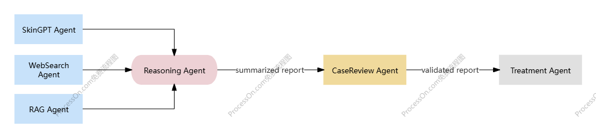

# SkinGPT-4X

## Overview
This project aims to develop an advanced version of SkinGPT-4, which is the SkinGPT-4X. To enhance the accuracy and explainability of the system, we employ a multi-agent framework where specialized agents collaborate to perform distinct tasks:
1. **RAG Agent**: Provides reliable, book-based knowledge from the Oxford Handbook.
2. **WebSearch Agent**: Searches the web for recent research articles, case reports, and clinical guidelines.
3. **SkinGPT Agent**: organizes preliminary medical observations from images
4. **Reasoning Agent**: Integrates RAGAgent’s knowledge, WebSearchAgent’s findings, and SkinGPT Agent's observations to generate diagnostic suggestions.
5. **CaseReview Agent**: Validates diagnoses by comparing them with historical cases and best practices.
6. **TreatmentRecommend Agent**: Suggests medications, skincare routines, or interventions based on diagnosis.

The workflow is as the image below:



## Usage
### Prerequisites
- Python 3.10
- Neo4j database
- OpenAI API keys

### Steps
1. Install dependencies:
   ```bash
   pip install -r requirements.txt
   ```

2. Set up Neo4j database:
   - Follow this [link](https://neo4j.com/docs/operations-manual/current/installation/) to install Neo4j.
   - change the **neo4j_password** in the "agent_workflow.py"
3. Set up the api key: 
   - change the **api key** in the "agent_workflow.py" and "api_utils.py"
4. Run:
   - Put the images in the "data/images" folder and run the following command:
   ```bash
   python agent_workflow.py --model_name "gpt-4o-mini" --image_folder "data/images/" --markdown_file_path "skin_handbook.md" --output_folder "output/"
   ```

## Uncompleted Files
- **skingpt_agent.py**: Ollama3.2-vision is used to simulated the output. Need to be modified to use the SkinGPT-4 model.