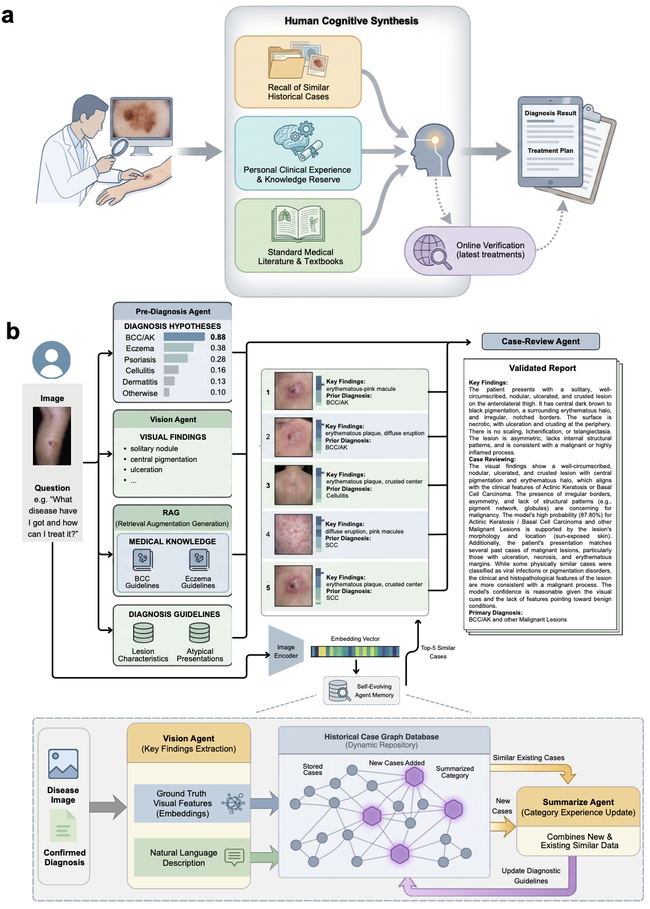
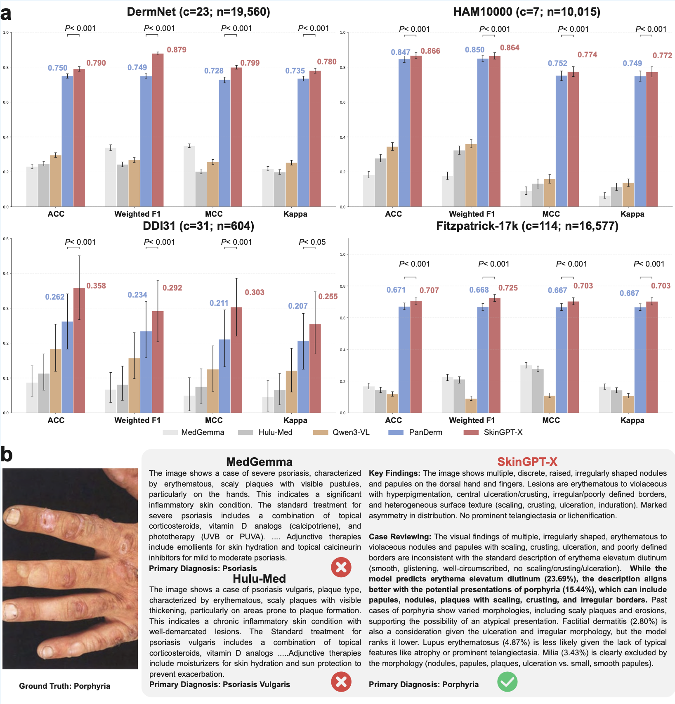
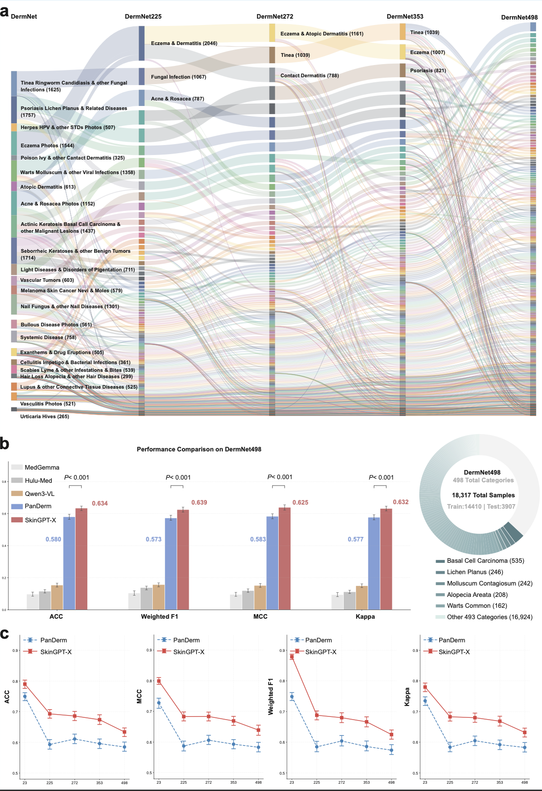
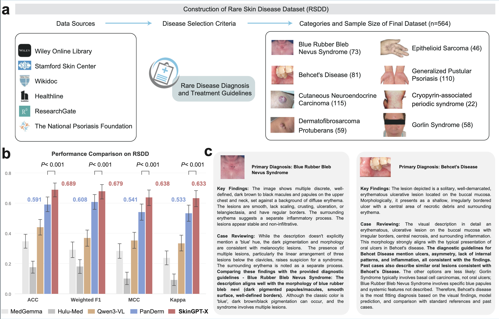
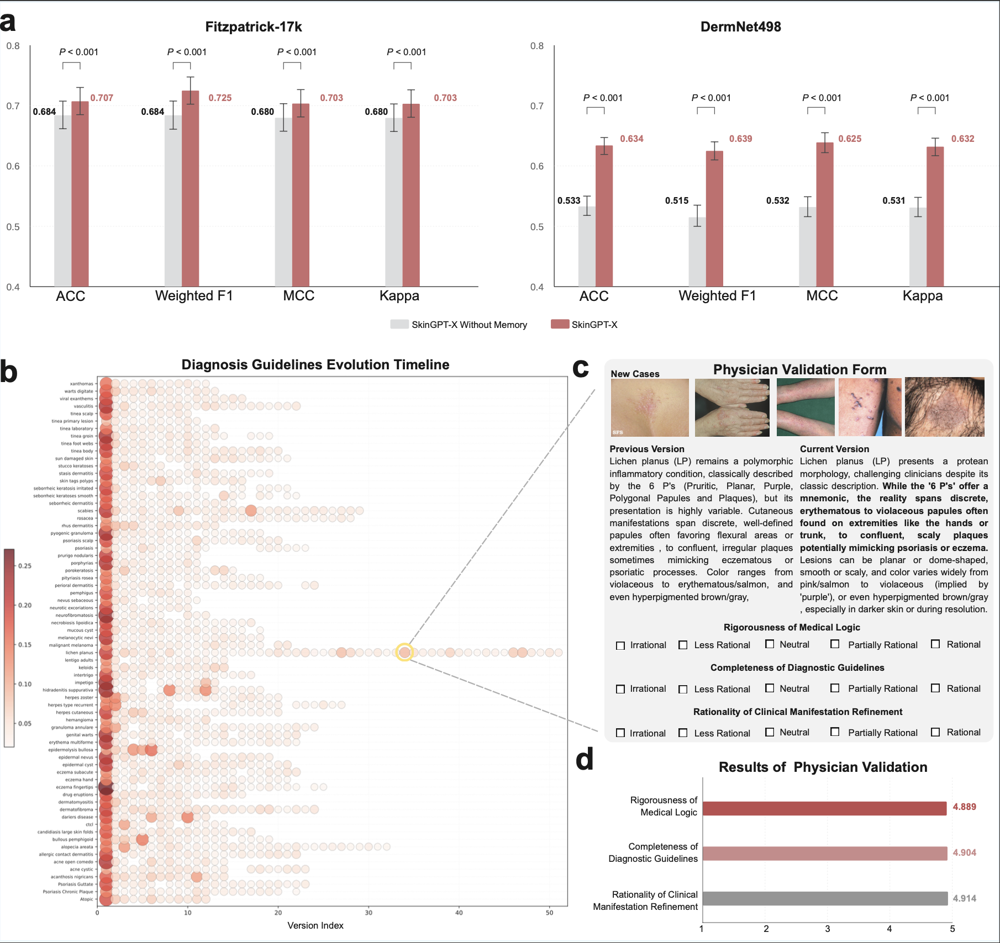

# SkinGPT-X

**A Self-Evolving Collaborative Multi-Agent System for Transparent and Trustworthy Dermatological Diagnosis**

*Zhangtianyi Chen†, Yuhao Shen†, Florensia Widjaja†, Yan Xu, Liyuan Sun, Zijian Wang, Hongyi Chen, Wufei Dai, Ziwen Wang, Xinyuan Zhang, Juexiao Zhou\**

*† Equal contribution · \* Corresponding author: juexiao.zhou@gmail.com*

*School of Data Science, The Chinese University of Hong Kong, Shenzhen*

[](https://arxiv.org/abs/2304.10674)
[](https://github.com/healme-225040511/Skingpt_X)
[](#license)
[](https://python.org)
[](https://pytorch.org)

---

## Overview

SkinGPT-X addresses two fundamental limitations of standalone LLMs in clinical dermatology: (1) **bottlenecks in high-cardinality and rare disease tasks** — static fine-tuned models fail to generalize across vast, fine-grained pathology distributions; (2) **insufficient traceability** — monolithic LLMs lack the diagnostic evidence chain required for clinical accountability.

By simulating the cognitive workflow of expert dermatologists, SkinGPT-X combines visual reasoning, textbook knowledge retrieval, and a **self-evolving agent memory (EvoDerma-Mem)** that continuously refines diagnostic guidelines through accumulated clinical experience — without parameter retraining.



*Figure 1. (a) Clinicians formulate diagnosis reports by integrating three pillars: personal clinical experience, standard medical literature, and recall of similar historical cases. (b) SkinGPT-X architecture: the Vision Agent extracts visual findings, the Pre-Diagnosis Agent generates hypotheses, and the RAG module retrieves handbook knowledge. The Case-Review Agent synthesizes all evidence with EvoDerma-Mem (top-5 similar cases + evolved guidelines) to produce a validated report. The Summarize Agent continuously updates the dynamic repository.*

---

## Architecture

SkinGPT-X orchestrates six specialized agents across two phases.

**Diagnostic Phase** — Vision Agent (Qwen3-VL) extracts fine-grained morphological findings. Pre-Diagnosis Agent (fine-tuned PanDerm) outputs top-5 candidate diagnoses with confidence scores. RAG Module retrieves disease-specific standards from the Oxford Handbook of Medical Dermatology via LanceDB.

**Review Phase** — Case-Review Agent (Qwen3-30B-A3B) synthesizes visual findings, handbook standards, and EvoDerma-Mem evidence (evolved guidelines + top-5 similar historical cases) through a 5-stage protocol: visual feature validation → canonical guidelines cross-check → empirical evidence alignment → conflict resolution → final diagnostic determination.

**Evolutionary Phase** — Summarize Agent distills confirmed cases into iteratively updated diagnostic guidelines, persisted as versioned `PrototypeVersion` snapshots in Neo4j without any parameter retraining.

---

## Key Results

SkinGPT-X consistently outperforms MedGemma, Hulu-Med, Qwen3-VL, and fine-tuned PanDerm across all four evaluation metrics (ACC, Weighted F1, MCC, Cohen's Kappa) on all benchmarks (p < 0.001, two-sided t-test).



*Figure 2. (a) Performance comparison across four public benchmark datasets. SkinGPT-X achieves +13.0% Weighted F1 on DermNet and +9.6% ACC on DDI31 over the second-best model. (b) Case study: MedGemma and Hulu-Med both misdiagnose a porphyria case as psoriasis, while SkinGPT-X correctly identifies the rare condition by cross-referencing evolved guidelines with visual findings.*

---

## High-Dimensional Classification

To stress-test SkinGPT-X under realistic fine-grained diagnostic complexity, we constructed **DermNet498**, re-categorizing DermNet from 23 broad super-classes into 498 clinically distinct sub-classes. For example, *Psoriasis pictures Lichen Planus and related diseases* is decoupled into 27 distinct classes (17 Psoriasis subtypes + 6 Lichen Planus variants). Intermediate-scale variants (DermNet225, DermNet272, DermNet353) enable controlled granularity ablation.



*Figure 3. (a) Hierarchical Sankey diagram showing category expansion from DermNet (23 classes) through DermNet225/272/353 to DermNet498 (498 classes, 18,317 samples). (b) SkinGPT-X achieves +5.4% ACC and +8.2% MCC over PanDerm on DermNet498 (p < 0.001). (c) As diagnostic granularity scales from 23 to 498 categories, SkinGPT-X consistently maintains a robust margin over PanDerm, preserving ACC / Weighted F1 / Kappa above 60%.*

---

## Rare Skin Disease Diagnosis

We curated the **Rare Skin Disease Dataset (RSDD)** — the first benchmark specifically addressing dermatological rare disease scarcity — comprising 564 clinical samples across 8 distinct categories, aligned with the Rare Disease Diagnosis and Treatment Guidelines published by the National Health Commission of China (2025). Sources include Wiley Online Library, Stamford Skin Center, Wikidoc, Healthline, ResearchGate, and the National Psoriasis Foundation. Train-test split is 1:2 to simulate data-scarce clinical conditions.

The 8 categories: Cutaneous Neuroendocrine Carcinoma (n=115), Generalized Pustular Psoriasis (n=110), Behcet's Disease (n=81), Blue Rubber Bleb Nevus Syndrome (n=73), Dermatofibrosarcoma Protuberans (n=59), Gorlin Syndrome (n=58), Epithelioid Sarcoma (n=46), Cryopyrin-associated Periodic Syndrome (n=22).



*Figure 4. (a) RSDD construction pipeline integrating diverse medical sources. (b) SkinGPT-X achieves +9.8% ACC, +7.1% Weighted F1, +9.7% MCC, +10% Kappa over fine-tuned PanDerm on RSDD (p < 0.001). (c) Representative rare disease case studies: EvoDerma-Mem enables correct identification of Blue Rubber Bleb Nevus Syndrome and Behcet's Disease by cross-referencing evolved guidelines with past cases, where competing models fail.*

---

## EvoDerma-Mem: Self-Evolving Agent Memory

EvoDerma-Mem is a graph-native clinical memory stored in Neo4j. Each case is stored as a linked triplet `Mᵢ = ⟨zᵢ, Kᵢ, Dᵢ⟩` (embedding, key findings, diagnosis). At inference, top-5 similar cases are retrieved by cosine similarity. When `ΔN ≥ N_thresh` new cases arrive for disease class C, guidelines evolve as `Gᵗ⁺¹_C = A(Gᵗ_C ⊕ K_new)`, with each version persisted as an immutable snapshot with delta score `δ = 1 − cos(z_new, z_prev)`.

**Neo4j graph schema:**

```
(Case)
  ├── image_path, case_id, true_label, sub_label
  ├── key_findings, feature_vector, findings_embedding
  └──[BELONGS_TO]──► (Prototype)
                          ├── current_summary, current_embedding, version_counter
                          └──[HAS_VERSION]──► (PrototypeVersion)
                                                 ├── summary, embedding, delta
                                                 └──[USED_CASE]──► (Case)
```



*Figure 5. (a) Ablation study: EvoDerma-Mem yields +10.1% ACC and +11.0% Weighted F1 on DermNet498 over the memory-free baseline (p < 0.001). (b) Guidelines Evolution Timeline showing iterative refinement across 50+ versions for 100+ disease categories — deeper color intensity indicates larger knowledge updates. (c) Lichen Planus guideline evolution example: the current version extends beyond the classic "6 P's" to cover atypical anatomical sites and morphological mimics of psoriasis/eczema. (d) Physician validation (n=100 cases, 5-point scale): Rigorousness of Medical Logic 4.889, Completeness of Guidelines 4.904, Rationality of Manifestation Refinement 4.914.*

---

## Quick Start
### 0. Reproduction Instructions
Shared data include the HAM10000, DDI, Fitzpatrick-17k, and Dermnet datasets. The HAM10000 dataset is accessible via the Harvard Dataverse at https: //doi.org/10.7910/DVN/DBW86T; the DDI dataset can be accessed through its official project repository at https://ddi-dataset.github.io/; the Fitzpatrick-17k dataset is available via its GitHub repository at https://github.com/mravuri/fitzpatrick17k; and the Dermnet dataset can be accessed at https://www.kaggle.com/datasets/shubhamgoel27/dermnet. 

Follow the steps below to run the pipeline on your own machine.
### 1. Environment

```bash
# Python 3.10+, Ubuntu 18.04+, CUDA 12.8
# Recommended hardware: 8× RTX 4090 (24 GB) for full local deployment
pip install -r requirements.txt
```

Dependencies: Neo4j, LanceDB (local), Qwen3-VL, Qwen3-30B-A3B, BGE-small-en-v1.5, LlamaIndex.

### 2. Download Hugging Face Models

The current code resolves model paths in this order: `SKINGPT_HF_HOME` -> `HF_HOME` -> `../hf_cache` relative to the repository root. If your project lives in a non-default location, you can also set `SKINGPT_PROJECT_ROOT` to the repository root. Download the minimal demo models first:

```bash
export SKINGPT_PROJECT_ROOT="$PWD"
export SKINGPT_HF_HOME="$PWD/../hf_cache"
export HF_HOME="$SKINGPT_HF_HOME"
# export HF_TOKEN=hf_xxx  # Optional: only needed for gated/private models
python scripts/download_hf_models.py --profile minimal
```

`--profile minimal` downloads:

- `BAAI/bge-small-en-v1.5` to `$HF_HOME/bge-small-en-v1.5/BAAI/bge-small-en-v1___5`
- `Qwen/Qwen2-VL-7B-Instruct` to `$HF_HOME/Qwen-VL-8B-Instruct`

For the larger README-level local deployment, use:

```bash
python scripts/download_hf_models.py --profile full
```

`--profile full` additionally downloads:

- `Qwen/Qwen3-VL-30B-A3B-Instruct-FP8` to `$HF_HOME/Qwen3-VL-30B`
- `Qwen/Qwen3-30B-A3B` to `$HF_HOME/Qwen3-30B-A3B`

### 3. Neo4j Setup For Fitzpatrick17k Case-Review Demo

This repository now includes a local `NEO4J_HOME/` copy inside the project root, so the Fitzpatrick17k demo can run end-to-end inside the repository. The demo script connects to the running `neo4j` database from this local copy.

```bash
cd /path/to/Skingpt_X
export NEO4J_HOME="$PWD/NEO4J_HOME"
export JAVA_HOME=/usr/lib/jvm/java-21-openjdk-amd64
export PATH="$JAVA_HOME/bin:$PATH"
$JAVA_HOME/bin/java -version
cd "$NEO4J_HOME/bin"
./neo4j start
```

If Neo4j prints `Unsupported Java 17 ... Please use Java(TM) 21`, the `JAVA_HOME` above is required. If you want the Fit17k backup store, make sure the local Neo4j copy is started against the store prepared as the active `neo4j` database, then connect with database name `neo4j` rather than `neo4j_backup_for_fit17k`.

### 4. A Quick Start Demo

This repository includes a small three-image demo that only runs `case_review_rag_agent.py` and reuses cached Fitzpatrick17k vision findings plus existing Panderm predictions.

```bash
cd /path/to/Skingpt_X
export SKINGPT_PROJECT_ROOT="$PWD"
export SKINGPT_HF_HOME="$PWD/../hf_cache"
python scripts/run_fit17k_case_review_demo.py
```

The script will:

- create a demo manifest and task file under `../Evaluation_Results/fitzpatrick17k/SkinGPT-X/case_review_rag_demo/`
- reuse an already-running Neo4j server when available
- read Fitzpatrick17k features from `../Evaluation_Results/fitzpatrick17k/SkinGPT-X/`
- write `case_review_results.json` and `case_review_prompts.json` into the demo output directory

### 5. Full Multi-Agent Inference

```bash
python agent_workflow.py \
  --model_name         "qwen3-30b-a3b" \
  --image_folder       "data/images/" \
  --markdown_file_path "skin_handbook.md" \
  --output_folder      "output/"
```

Current checkout status: the command above is the intended demo entrypoint, but this repository snapshot is not yet runnable in a clean environment without additional files/services. `agent_workflow.py` imports `case_review_agent.py`, `reasoning_agent.py`, `skingpt_agent.py`, and `web_search_agent.py`, but only compiled `__pycache__` artifacts are present. It also requires installed Python dependencies, a local LanceDB directory, Neo4j, input image data, and PanDerm prediction CSVs at the configured paths.

### 6. Build / Evolve Knowledge Base

```bash
# Initial build from labelled image split
python build_knowledge_base_evolve.py \
  --txt              "/path/to/split.txt" \
  --eval_dir         "/path/to/eval_dir" \
  --image_dir        "/path/to/image_root/" \
  --use_sub_label \
  --distill_recent_k 10

# Backfill sub_label for existing DB cases only
python build_knowledge_base_evolve.py \
  --eval_dir        "/path/to/eval_dir" \
  --image_dir       "/path/to/image_root/" \
  --update_existing \
  --use_sub_label
```

---

## Demo


https://github.com/user-attachments/assets/d3cd82cd-6fc0-46d4-b3bc-65738a1a34e9


## Citation
If this project is helpful for you.

```bibtex
@article{chen2025skingptx,
  title   = {SkinGPT-X: A Self-Evolving Collaborative Multi-Agent System
             for Transparent and Trustworthy Dermatological Diagnosis},
  author  = {Chen, Zhangtianyi and Shen, Yuhao and Widjaja, Florensia
             and Xu, Yan and Sun, Liyuan and Wang, Zijian and Chen, Hongyi
             and Dai, Wufei and Wang, Ziwen and Zhang, Xinyuan and Zhou, Juexiao},
  year    = {2025},
  note    = {CUHK-Shenzhen, Award No. UDF01004172}
}
```

Related work: [SkinGPT-R1](https://arxiv.org/abs/2511.15242) · [SkinGPT-4](https://arxiv.org/abs/2304.10674) · [PanDerm](https://www.nature.com/articles/s41591-025-03383-2)

---

## License

Code in this repository is licensed under the MIT License. See [LICENSE](./LICENSE).

Documentation, README content, and other non-code materials in this repository are licensed under the Creative Commons Attribution 4.0 International License (CC BY 4.0). See [LICENSE-docs](./LICENSE-docs) or visit https://creativecommons.org/licenses/by/4.0/.

